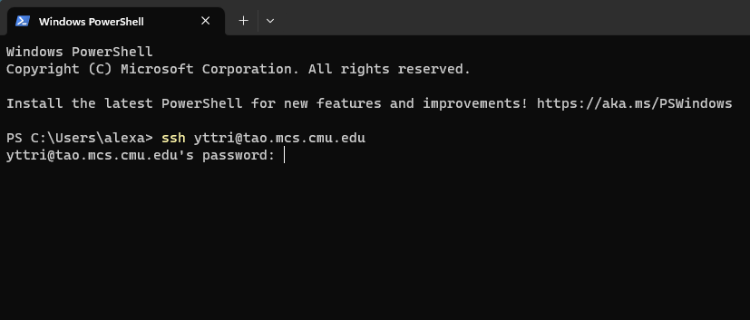
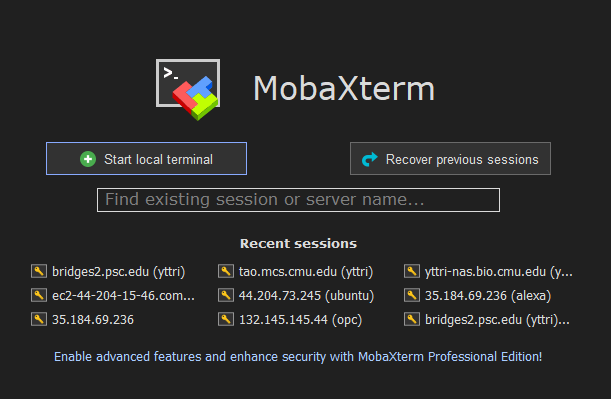
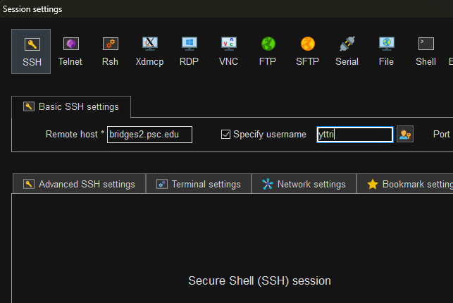

# yttri-ephys-protocol
Yttri Lab ephys analysis protocol


### Prerequisite
For OpenEphys, you must have the following files transferred to network drive

<span style="color:orange;font-weight:350;font-size:18px">
     continuous.dat
</span>


### Move your file to PSC to utilize GPU

First, transfer the `continuous.dat` file from network drive `Z:\ ` to `data.bridges.psc.edu`

##### Step 1.1: Network drive log in
Open windows powershell and log into network drive `Z:\ `.



##### Step 1.2: Transfer binary file to PSC bridges2
Once logged in, you will be in `Z:\ ` directory. To transfer the file over to PSC:

```commandline
scp -r -caes128-gcm@openssh.com -o Compression=no AE2_Training/072423/ yttri@data.bridges.psc.edu:/ocean/projects/bio210065p/yttri/AE2_Training/
```

This should be transfering at
<span style="color:orange;font-weight:350;font-size:18px">
     >500MB/s
</span>


### Log into PSC bridges2 and run matlab
Confirm that you have mobaxterm installed (only available in windows).

##### Step 2.1: Log into bridges2
If you had previously logged into bridges2 before, you can simply select that session.


Otherwise, select `Session -> New session`. Select the left most SSH button, and enter credentials.


##### Step 2.2: Interact with a partition of the GPU.
First, go into the project directory that houses the computational resources.
```commandline
cd /ocean/projects/bio210065p/yttri
```

Then, ask for a partition within the GPU-shared resource.
```commandline
interact -p GPU-shared --gres=gpu:v100-32:1 -t 08:00:00
```


The `-t 08:00:00` is asking for shared node for up to <span style="color:orange;font-weight:350;font-size:18px">
     8 hours
</span>

##### Step 2.3: Load matlab
Once you have access to the GPU node. You can load up matlab.
```commandline
module load matlab
matlab
```

MATLAB 2022b will pop up and allow you to run kilosort like you would on a normal computer.


### Manual sorting with Phy
Once kilosort3 is finished, we can transfer the processed files back to `Z:\ ` to manual sort the neurons.

##### Step 3.1: Network drive log in
Same as Step 1.1. Open windows powershell and log into network drive `Z:\ `.


##### Step 3.2: Transfer processed folder from PSC bridges2 back to network drive
Once logged in, you will be in `Z:\ ` directory. To transfer the file from PSC back to `Z:\ `:

```commandline
scp -r yttri@data.bridges.psc.edu:/ocean/projects/bio210065p/yttri/AE2_Training/072423_processed/ ./AE2_Training/
```


##### Step 3.3: Edit the params.py file.
Use notepad or whatever program that can read the file.
Change the path prefix from `/ocean/projects/bio210065p/yttri/YOUR/PROCESSED/FOLDER` to `Z:/YOUR/PROCESSED/FOLDER` 
for example:
Change
```
dat_path = '/ocean/projects/bio210065p/yttri/AE2_Training/072423_processed/temp_wh.dat'
```
to
```
dat_path = 'Z:/AE2_Training/072423_processed/temp_wh.dat'
```

##### Step 3.4: Run Phy2
Open anaconda3 terminal on Wartooth, and activate preinstalled environment.
```commandline
conda activate phy2
```

Then go to the processed folder directory on `Z:\ `
```commandline
pushd Z:/AE2_Training/072423_processed/
```

You can either use the saved settings from last time:
```commandline
phy template-gui params.py
```

Or use the default settings:
```commandline
phy template-gui params.py --clear-cache --clear-state --debug
```


